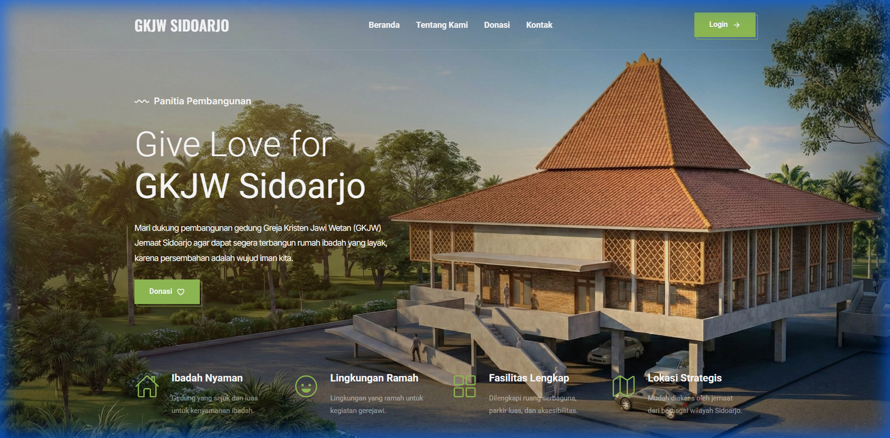
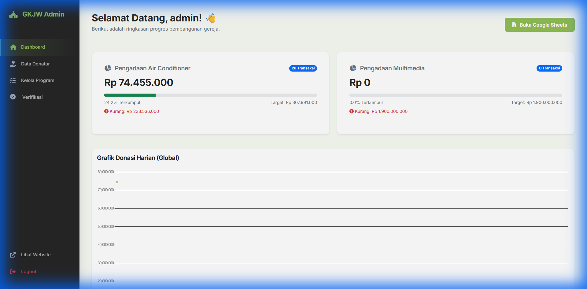
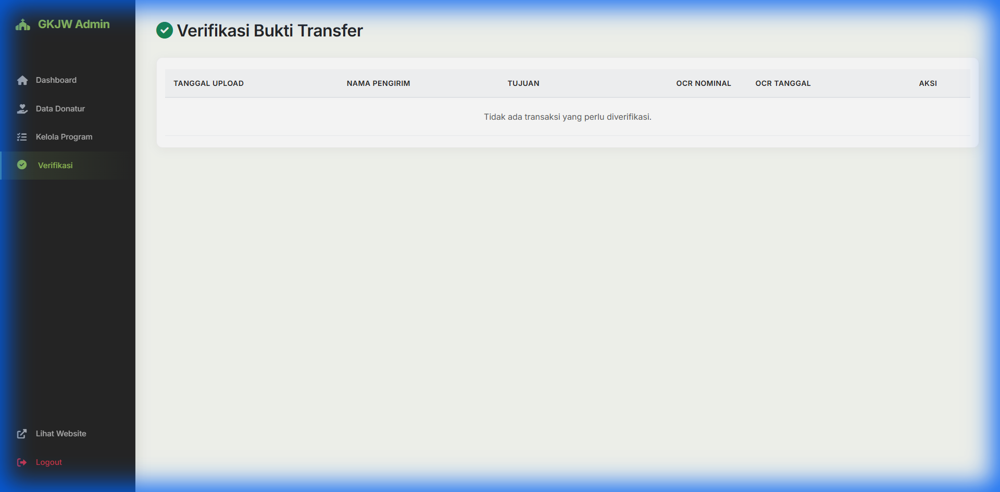

# GKJW Sidoarjo - Pembangunan Gereja & Multimedia System

Platform web modern untuk penggalangan dana pembangunan Gereja GKJW Sidoarjo. Dilengkapi dengan landing page informatif, verifikasi pembayaran otomatis (OCR), dan dashboard admin yang komprehensif.



## ✨ Fitur Utama

### 1. 🌐 Public Landing Page
*   **Dynamic CMS**: Tampilkan program donasi tanpa batas yang diatur langsung dari admin.
*   **Dual-Name Privacy**: Menjaga privasi donatur dengan sistem **Alias Otomatis** (misal: "Agus" -> "A..."). Nama asli hanya terlihat oleh admin.
*   **Real-Time Progress**: Grafik donasi (Terkumpul vs Target) update secara otomatis.
*   **Responsive Theme**: Desain "Wildvine" yang elemen dan estetik, optimal untuk Mobile & Desktop.

### 2. 🛡️ Sistem Upload & Verifikasi Cerdas
*   **OCR (Optical Character Recognition)**:
    *   Otomatis membaca **Nominal** dan **Tanggal** dari foto struk transfer menggunakan `Tesseract.js`.
    *   Support format tanggal Indonesia (misal: `12 Januari 2024` atau `20-12-2024`).
*   **Strict Security Filter**:
    *   **Keyword Validation**: Menolak otomatis bukti transfer yang tidak mengandung kata kunci "GKJW", "SIDOARJO", atau "GEREJA".
    *   **Visual Feedback**: Progress bar berubah **MERAH** jika bukti tidak valid, mencegah upload sampah.
*   **Auto-Delete Policy**: Gambar bukti transfer otomatis dihapus dari server setelah diverifikasi untuk menghemat penyimpanan.

### 3. 🖥️ Admin Dashboard

*   **Statistik Harian**: Grafik pemasukan donasi per hari.
*   **Manajemen Program**: Tambah, Edit (Ganti Gambar/Target), dan Hapus program donasi.
*   **Smart Sidebar**: Notifikasi **Badge Merah** jika ada verifikasi tertunda.
*   **Verifikasi Cepat**:
    *   Side-by-side view: Foto Asli vs Hasil OCR.
    *   **Auto-Alias**: Sistem otomatis membuat inisial nama untuk tampilan publik.
    *   Tombol Approve/Reject dengan konfirmasi aman.
    *   

## 🚀 Panduan Instalasi (Hostinger / cPanel)

Program ini didesain agar sangat ringan (**~10 MB**) dan mudah di-deploy.

### 1. Upload File
Upload seluruh folder project ke `public_html` di File Manager hosting Anda.

### 2. Buat Database
Buat database baru di MySQL Databases (misal: `u12345_gkjw`).

### 3. Konfigurasi Database
Rename `db_config.example.php` menjadi `db_config.php` dan isi detail database:
```php
define('DB_SERVER', 'localhost');
define('DB_USERNAME', 'u12345_user');
define('DB_PASSWORD', 'password_anda');
define('DB_NAME', 'u12345_gkjw');
```

### 4. Instalasi Otomatis (Master Script)
Akses: `www.website-anda.com/init_db.php`
Script ini akan:
1.  Membuat tabel (`programs`, `donations`, `users`, `transactions`).
2.  Mereset & menanam data awal (Seed).
3.  Membuat akun admin default.

> **PENTING**: Hapus file `init_db.php` setelah instalasi selesai!

## 🔐 Akses Admin
*   URL: `/dashboard/login.php`
*   User: `admin`
*   Pass: `admin123`

## 🛠️ Tech Stack
*   **Backend**: PHP 7.4 / 8.x (Native)
*   **Frontend**: HTML5, CSS3 (Variables), Bootstrap 5
*   **Database**: MySQL / MariaDB
*   **Libraries**:
    *   `Tesseract.js` (OCR Engine)
    *   `SweetAlert2` (Notifications)
    *   `Chart.js` (Statistics)
    *   `DataTables` (Interactive Grids)

---
**Developed for GKJW Sidoarjo.**
*Secure. Fast. Dynamic.*
